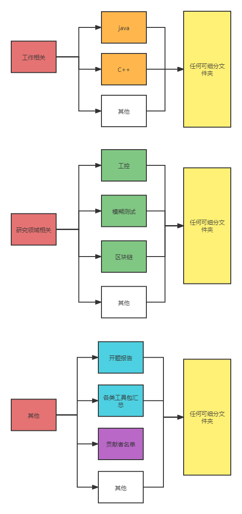
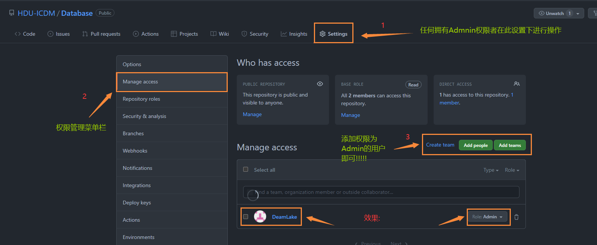
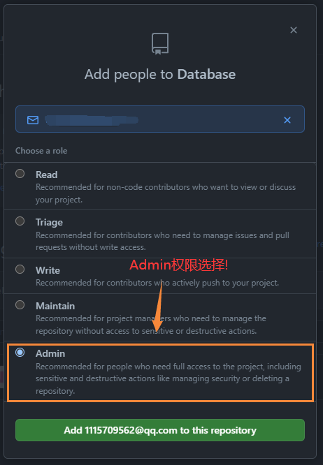

# ICDM_Database
:zap:隶属于杭电ICDM实验室的历代传承仓库

本仓库存在的意义:

> :european_castle:方便日后各位同僚更加便利的找工作,提供面经,资料等搜集工作!
>
> :european_castle:方便各方向新进研究者更加快速的了解本领域的相关知识
>
> :european_castle:方便灵魂的碰撞,思想的交流,更好的发出论文.

### 使用方式:

:two_hearts:上一届的师兄师姐将本方向的新进同学拉进项目中作为项目协作者,提升所有ICDM人对本仓库的使用管理等权限

:two_hearts:任何人都可以将本仓库`clone`到本地,熟悉`git`的同学还可以进行`fork`

:two_hearts:任何拥有权限的ICDM管理者可以自由上传对应方向的文件,作为自己未来的参考或无偿开放给其他人

:two_hearts:任何为本仓库贡献过的所有人都可以将自己的姓名,小段简历存放在贡献者名单中,让所有未来的同学记住你曾今为ICDM所做出的贡献!

:two_hearts:**强烈推荐大家将资料进行好分类在上传到此仓库中,为了未来的方便查阅!!**

:two_hearts:强烈建议学会`git`命令,其次可以选择github的`Desktop`桌面版本来实现更加方便的操作!!!  (https://desktop.github.com/)

### 内容增加协议

所有的上传的内容模块需要遵循下面给出的分级原则,任何地方都可经过大家同意进行更改!

### 国内加速克隆办法

原地址:`https://github.com/xxxx/xxxxxx.git`

加速地址:`https://github.com.cnpmjs.org/xxxxx/xxxxxxx.git`

### 管理员权限添加流程

图片使用图床功能,github可能显示不全 ,可以下载到本地查阅!

### 仓库未来愿景

:ice_cream:愿所有进入ICDM实验室的同学能更快的融入到ICDM实验室

:jack_o_lantern:愿所有进入ICDM实验室的同学能更迅速的了解到自己未来要做的事情

:candy:愿所有进入ICDM实验室的同学能更好的实现自己的人生目标
